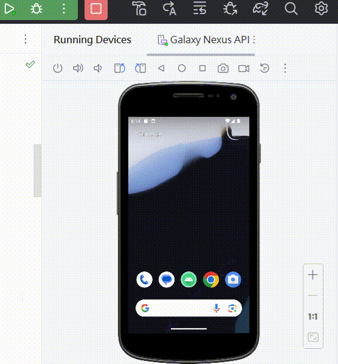

# Android 圖像處理應用 - 自動輪廓分割

在現代移動應用中，圖像處理已成為一個重要的領域，為用戶提供豐富的視覺體驗。本篇文章將介紹一個基於 Android 平台的圖像處理應用，該應用具有從相冊中選擇照片、進行自動輪廓分割並顯示的功能。

## 功能概要：

1. **打開相冊並選擇照片**：

   使用者可以透過應用中的 "Open Gallery" 按鈕輕鬆地打開相冊，並選擇他們想要進行處理的照片。

2. **自動輪廓分割**：

   當使用者選擇完照片後，透過 "Process Image" 按鈕，應用將自動進行圖像處理。該處理步驟包括將彩色圖轉換為灰度圖，應用 Canny 邊緣檢測算法進行分割，找到圖像的主要輪廓，然後將這些輪廓用黑色線條畫在原始照片上。

3. **顯示處理後的圖片**：

   處理後的圖片將在應用中顯示，使用者可以清晰地看到原始照片的主要輪廓，同時其他區域被標記為黑色。

4. **重新選擇照片**：

   在完成一次圖像處理後，使用者可以再次按下 "Open Gallery" 以重新選擇不同的照片進行處理。

## 技術細節：

- **OpenCV 整合**：

  本應用整合了 OpenCV，一個廣泛用於圖像處理的開源庫。通過 OpenCV，我們可以輕鬆地將圖片轉換為 Mat 對象，應用各種圖像處理算法。

- **圖像分割和輪廓查找**：

  圖像處理的核心部分是將圖像分割為主要區域，這裡使用 Canny 邊緣檢測算法實現。接著，應用 OpenCV 的 `findContours` 方法找到圖像中的主要輪廓。

- **顯示處理後的圖片**：

  最終，處理後的圖片轉換回 Bitmap 並在應用中顯示。這樣，使用者可以輕鬆理解圖像經過處理後的效果。

## 結語：

這個 Android 圖像處理應用展示了如何整合 OpenCV，應用先進的圖像處理技術，同時提供直觀的用戶界面。用戶可以通過簡單的操作，對他們的照片進行有趣且直觀的處理，體驗圖像處理的魅力。

（請注意，此範例僅包含基本功能，實際應用中可能需要更多的功能和錯誤處理。）


## activity_main.xml

```
<!-- activity_main.xml -->
<RelativeLayout xmlns:android="http://schemas.android.com/apk/res/android"
    xmlns:tools="http://schemas.android.com/tools"
    android:layout_width="match_parent"
    android:layout_height="match_parent"
    tools:context=".MainActivity">

    <ImageView
        android:id="@+id/imageViewOriginal"
        android:layout_width="match_parent"
        android:layout_height="match_parent"
        android:contentDescription="original_image_description"
        android:scaleType="centerCrop" />

    <ImageView
        android:id="@+id/imageViewProcessed"
        android:layout_width="match_parent"
        android:layout_height="match_parent"
        android:scaleType="centerCrop"
        android:visibility="gone"
        android:contentDescription="processed_image_description"
        />

    <Button
        android:id="@+id/btnProcess"
        android:layout_width="wrap_content"
        android:layout_height="wrap_content"
        android:layout_alignParentBottom="true"
        android:layout_centerHorizontal="true"
        android:layout_marginBottom="50dp"
        android:text="Process Image" />

    <Button
        android:id="@+id/btnOpenGallery"
        android:layout_width="wrap_content"
        android:layout_height="wrap_content"
        android:layout_alignParentBottom="true"
        android:layout_centerHorizontal="true"
        android:layout_gravity="center"
        android:text="OpenGallery" />

</RelativeLayout>

```

## MainActivity.java

```
package com.example.opencv;
import android.app.Activity;
import android.content.Intent;
import android.graphics.Bitmap;
import android.os.Bundle;
import android.provider.MediaStore;
import android.util.Log;
import android.view.View;
import android.widget.Button;
import android.widget.ImageView;

import com.example.readphotosandapplyopencv.R;

import org.opencv.android.OpenCVLoader;
import org.opencv.android.Utils;
import org.opencv.core.Core;
import org.opencv.core.CvType;
import org.opencv.core.Mat;
import org.opencv.core.MatOfPoint;
import org.opencv.core.Scalar;
import org.opencv.core.Size;
import org.opencv.imgproc.Imgproc;

import java.io.File;
import java.io.FileNotFoundException;
import java.io.FileOutputStream;
import java.io.IOException;
import java.util.ArrayList;
import java.util.Collections;
import java.util.List;

public class MainActivity extends Activity {

    private static final int REQUEST_OPEN_GALLERY = 1;

    private ImageView imageViewOriginal, imageViewProcessed;
    private Button btnProcess, btnOpenGallery;
    private Bitmap originalBitmap;

    static {
        if (!OpenCVLoader.initDebug()) {
            Log.e("OpenCV", "OpenCV initialization failed.");
        } else {
            Log.d("OpenCV", "OpenCV initialization succeeded.");
        }
    }

    @Override
    protected void onCreate(Bundle savedInstanceState) {
        super.onCreate(savedInstanceState);
        setContentView(R.layout.activity_main);

        // 初始化視圖
        imageViewOriginal = findViewById(R.id.imageViewOriginal);
        imageViewProcessed = findViewById(R.id.imageViewProcessed);
        btnProcess = findViewById(R.id.btnProcess);
        btnOpenGallery = findViewById(R.id.btnOpenGallery);

        // 設置按鈕點擊監聽器
        btnProcess.setOnClickListener(new View.OnClickListener() {
            @Override
            public void onClick(View view) {
                if (originalBitmap != null) {
                    // 如果是原始狀態，進行圖像處理
                    doSegmentation(originalBitmap);
                }
            }
        });

        btnOpenGallery.setOnClickListener(new View.OnClickListener() {
            @Override
            public void onClick(View view) {
                openGallery();
            }
        });
    }

    // 打開相冊
    private void openGallery() {
        Intent intent = new Intent(Intent.ACTION_PICK, MediaStore.Images.Media.EXTERNAL_CONTENT_URI);
        startActivityForResult(intent, REQUEST_OPEN_GALLERY);
    }

    // 處理返回結果
    @Override
    protected void onActivityResult(int requestCode, int resultCode, Intent data) {
        super.onActivityResult(requestCode, resultCode, data);

        if (requestCode == REQUEST_OPEN_GALLERY && resultCode == RESULT_OK && data != null) {
            // 從相冊選擇照片後返回
            try {
                Bitmap selectedImage = MediaStore.Images.Media.getBitmap(
                        this.getContentResolver(), data.getData());
                originalBitmap = selectedImage;
                imageViewOriginal.setImageBitmap(originalBitmap);
            } catch (Exception e) {
                e.printStackTrace();
            }
        }
    }

    // 圖像分割並顯示輪廓
    private void doSegmentation(Bitmap originalBitmap) {
        // 轉換為Mat對象
        Mat originalMat = new Mat();
        Utils.bitmapToMat(originalBitmap, originalMat);

        // 將彩色圖轉換為灰度圖
        Mat grayMat = new Mat();
        Imgproc.cvtColor(originalMat, grayMat, Imgproc.COLOR_BGR2GRAY);

        // 使用Canny邊緣檢測算法進行分割
        Mat edges = new Mat();
        Imgproc.GaussianBlur(grayMat, grayMat, new Size(5, 5), 1.5, 1.5);
        Imgproc.Canny(grayMat, edges, 100, 200);

        // 尋找輪廓
        List<MatOfPoint> contours = findContours(edges);

        // 繪製輪廓並將分割區域標記為前景
        Imgproc.drawContours(originalMat, contours, -1, new Scalar(0, 0, 0), 5);

        // 顯示處理後的Mat
        Bitmap processedBitmap = Bitmap.createBitmap(originalMat.cols(), originalMat.rows(), Bitmap.Config.ARGB_8888);
        Utils.matToBitmap(originalMat, processedBitmap);

        // 顯示處理後的圖像
        imageViewProcessed.setImageBitmap(processedBitmap);
        imageViewProcessed.setVisibility(View.VISIBLE);
        imageViewOriginal.setVisibility(View.GONE);
    }

    // 尋找輪廓
    private List<MatOfPoint> findContours(Mat edges) {
        List<MatOfPoint> contours = new ArrayList<>();
        Mat hierarchy = new Mat();
        Imgproc.findContours(edges, contours, hierarchy, Imgproc.RETR_EXTERNAL, Imgproc.CHAIN_APPROX_SIMPLE);
        return contours;
    }
}

```

## AndroidManifest.xml

```
<?xml version="1.0" encoding="utf-8"?>
<manifest xmlns:android="http://schemas.android.com/apk/res/android"
    xmlns:tools="http://schemas.android.com/tools">
    <uses-permission android:name="android.permission.WRITE_EXTERNAL_STORAGE" />
    <uses-permission android:name="android.permission.READ_EXTERNAL_STORAGE" />


    <application
        android:allowBackup="true"
        android:dataExtractionRules="@xml/data_extraction_rules"
        android:fullBackupContent="@xml/backup_rules"
        android:icon="@mipmap/ic_launcher"
        android:label="@string/app_name"
        android:roundIcon="@mipmap/ic_launcher_round"
        android:supportsRtl="true"
        android:theme="@style/Theme.ReadPhotosAndApplyOpencv"
        tools:targetApi="31">
        <activity
            android:name="com.example.opencv.MainActivity"
            android:exported="true">
            <intent-filter>
                <action android:name="android.intent.action.MAIN" />

                <category android:name="android.intent.category.LAUNCHER" />
            </intent-filter>
        </activity>
    </application>

</manifest>
```


### 成果展示




```python

```
